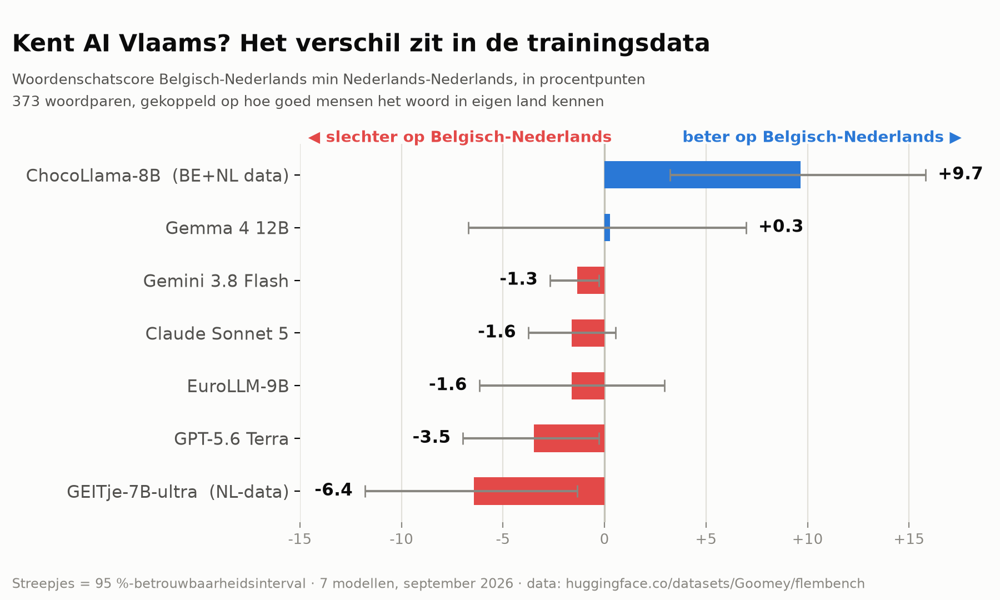

# flembench — does your AI model know Flemish?

**Do current LLMs understand Belgian Dutch (Flemish) less well than Netherlands Dutch?**
493 matched word pairs, 986 questions, 7 models, about €1.25 of API budget.



| Model | Belgian | Netherlands | Gap | 95% CI | p |
|---|---|---|---|---|---|
| **ChocoLlama-8B** (Belgian + NL training data) | 69.2% | 59.5% | **+9.7** | +3.2 … +15.8 | 0.004 ✔ |
| **GEITje-7B-ultra** (Netherlands-centric data) | 78.8% | 85.3% | **−6.4** | −11.8 … −1.3 | 0.022 |
| GPT-5.6 Terra | 92.5% | 96.0% | −3.5 | −7.0 … −0.3 | 0.060 |
| Claude Sonnet 5 | 96.8% | 98.4% | −1.6 | −3.8 … +0.5 | 0.210 |
| EuroLLM-9B | 88.2% | 89.8% | −1.6 | −6.2 … +2.9 | 0.561 |
| Gemini 3.8 Flash | 98.7% | 100.0% | −1.3 | −2.7 … −0.3 | 0.062 |
| Gemma 4 12B | 63.3% | 63.0% | +0.3 | −6.7 … +7.0 | 1.000 |

A positive gap means *better* on Belgian Dutch. After Holm correction for seven models, only
ChocoLlama's gap is significant on its own.

## The short version

Dutch-language AI evaluation rarely separates Belgian from Netherlands Dutch. For Flemish
organisations deploying these tools, that is precisely the question.

The catch in any such comparison: if the Belgian questions are simply harder, a lower score proves
nothing. So every Belgian word is paired with a Netherlands word that is **equally well known in
its own country**, using prevalence data for 54,000 words. Mean difference inside a pair: **0.6
percentage points**.

The most interesting result is not about the big models:

- **ChocoLlama** (the only model with Belgian training data) scores **9.7 points better** on
  Belgian Dutch.
- **GEITje** (mainly Netherlands data) scores **6.4 points worse** — same size, opposite direction.
- **Claude, GPT and Gemini** sit 1 to 4 points lower on Belgian, but at 97–100% they are near the
  ceiling, so those numbers are lower bounds.

In short: putting Belgian data into training visibly pays off. For the largest models the
difference is small, but it points the same way in five of seven cases.

Dutch write-up: **[docs/bevindingen.md](docs/bevindingen.md)** ·
Dataset: **[huggingface.co/datasets/Goomey/flembench](https://huggingface.co/datasets/Goomey/flembench)**

---

## How it works, in more detail

### 1. The pairing is the whole design

Word knowledge is measured, not assumed. The Dutch Crowdsourcing Project (Brysbaert, Keuleers,
Mandera & Stevens 2019) recorded, for 54,000 words, what share of **Belgians** and what share of
**Dutch speakers** know each one.

- **Candidates:** known by ≥80% in their own country and ≥30 points less in the other → 584 Belgian,
  497 Netherlands words.
- **Matching:** one-to-one assignment (Hungarian algorithm) on own-country familiarity (±3 points)
  and on the between-country difference (±5 points) → **493 pairs**, mean within-pair difference
  0.6 points.
- Because human difficulty is equal by construction, a difference in model scores is a property of
  the model rather than of the word list.

Full rationale, rejected alternatives and trade-offs:
**[docs/decisions/0001-pairing.md](docs/decisions/0001-pairing.md)**.

### 2. Questions are generated, not hand-written

One template for both varieties, so nothing differs except the word and the country name:

> Wat betekent het woord "zwalpen" zoals het in België gebruikt wordt?
> A. klotsen · B. treuzelen · C. een beetje dik · D. dorpsplein

- **Distractors** are meanings of other words in the set, filtered to share no content word with the
  correct answer, not to resemble the target word, and to be of comparable length.
- **The correct answer occupies the same position in both members of a pair**, so a model's
  preference for a letter (ChocoLlama picks "A" 49% of the time) cannot create a gap.
- **120 pairs whose meaning resembles its own word** (*bakkerin* → *bakkersvrouw*) are labelled
  `A1a-overlap` and excluded from the headline; they are reported separately.

### 3. Correct answers have traceable provenance

Meanings were drafted independently by two models from different providers and then checked:

| Source | Count |
|---|---|
| Claude and Gemini independently agreed | 1,018 of 1,081 |
| Disagreements resolved by the author (native Flemish speaker) | 63 |
| Uncertain Netherlands words decided by a Netherlands-Dutch speaker | 11 (4 rejected) |

Every item records `drafted_by` and `reviewed_by`, so anyone can check whether LLM-drafted answers
skewed the result. This matters because one of the drafting models (Claude) is also under test.

### 4. Statistics

- **Paired comparison**: the gap is the mean over pairs of (Belgian correct − Netherlands correct).
- **95% confidence intervals** by bootstrap **over pairs** (10,000 resamples), not over items.
- **Exact McNemar test** per model, **Holm-corrected** across the seven models.
- **Variance**: 60 pairs run three times per model. 93–99% identical answers, so no model is fully
  deterministic, not even locally at temperature 0 with a fixed seed. Differences below 1–2 points
  are noise.
- **Held-out split**: 20% of pairs live in a private repository, so contamination of the public set
  can be detected later.

### 5. Engineering

- **One adapter interface** for Anthropic, OpenAI, Gemini and local models via Ollama; run
  conditions (reasoning off or minimal) recorded per model, since they are not uniform across
  providers.
- **Every response is cached**, so re-scoring is free and reproducible; `flembench rescore` rebuilds
  all results without a single API call.
- **Cost estimate before every run** plus a hard budget stop.
- **Local model weights pinned by SHA-256**; `scripts/check_local_tokenization.py` verifies that
  each local model receives exactly the token sequence its original tokenizer would produce, because
  a wrong chat template would silently handicap a model.
- **83 tests, no network**; CI runs lint, tests, item schema validation and a schema-drift check.

## Reproduce

```bash
uv sync --all-extras
cp .env.example .env            # add API keys
uv run flembench generate-a1    # build questions from the word pairs
uv run flembench estimate claude-sonnet-5
uv run flembench run claude-sonnet-5 --budget 1
uv run flembench rescore        # re-scores everything from cache, no API calls
uv run python scripts/error_analysis.py
```

## What this does not show

- **Isolated word meaning only** — no context, no syntax, no administrative language, no
  institutional knowledge.
- **Ceiling effect** for the strongest models, making their gaps lower bounds.
- **Gold answers partly LLM-drafted**, one drafting model is under test.
- **No human baseline**: model scores are not compared against native speakers on the same
  questions.
- **Seven models, seven tests**: after correction only one difference stands on its own.
- **Local models are quantised** (Q8_0, Gemma 4-bit).

The full list, with the reasoning behind each point, is in the
[Dutch write-up](docs/bevindingen.md#wat-dit-onderzoek-niet-aantoont).

## Repository map

| Path | Contents |
|---|---|
| `src/flembench/` | harness: adapters, cache, scoring, statistics, item generation |
| `items/A1/auto/` | the 394 public question pairs (YAML, one file per pair) |
| `data/` | compiled dataset, curation decisions, dataset card |
| `runs/cache/` | every model response, for reproducible re-scoring |
| `analysis/` | error analysis and the headline figure |
| `docs/` | Dutch write-up, design document, decision records |

## Licences

Code MIT (`LICENSE`), dataset CC BY 4.0 (`LICENSE-DATA.md`). Word selection derives from norms
licensed CC BY-NC 4.0, which are not redistributed here.
